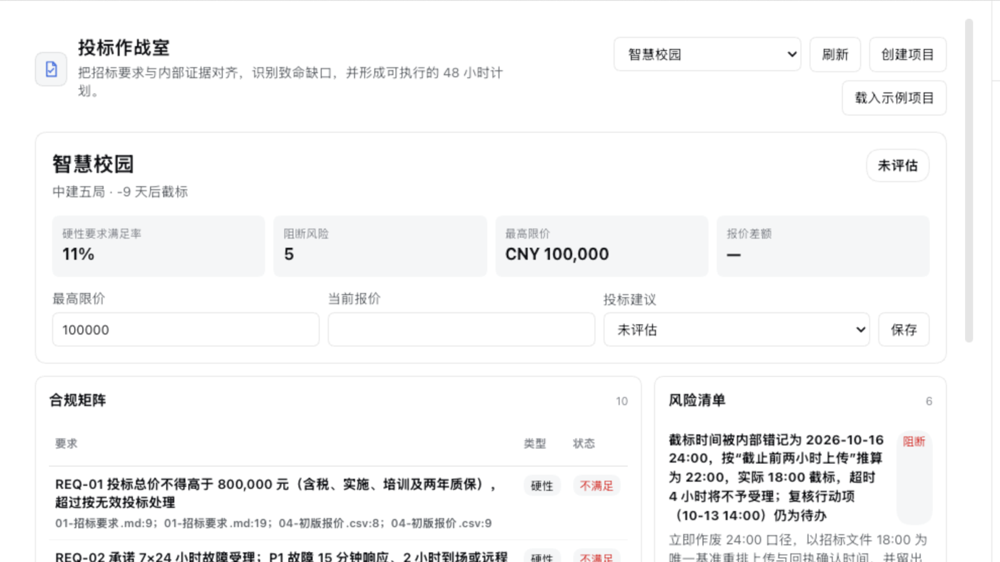

# DSH 投标作战室

一个面向售前、商务和投标团队的本地 DSH Desktop 工作台。它把招标要求、内部证据、风险、待决策事项和 48 小时行动计划放在同一个业务面板中，并让归属于该工作台的原生 DSH 会话安全地读取和更新这些结构化记录。

当前版本：`0.1.0`。安装包通过 GitHub Release 发布，并提交到 DSH 工作台市场审核。



## 能做什么

- 在没有会话时创建、选择和维护投标项目。
- 查看 Go / Conditional Go / No-Go 建议、硬性要求满足率、报价差额和阻断风险。
- 维护合规矩阵、风险清单、48 小时行动项、决策和分析记录。
- 通过“连接资料并开始分析”显式选择本地资料目录，创建 Desktop 原生工作区与会话。
- 让 Agent 通过 `bid_workbench_read` 和 `bid_workbench_update` 读取、分析并在确认后写回当前项目。
- 通过 3 秒可见轮询、窗口重新可见刷新和手动刷新显示 Agent 写回结果。
- 明确载入“智慧园区数字化平台投标”演示项目。示例不会静默写入，也不会修改其他项目。

## 包结构

```text
package.json
cordis.patch.yml
dsh/index.mjs       # DSH 服务端入口
lib/client.js       # 已构建的单文件 Web 客户端
src/model.mjs       # 严格状态模型与 mutation 白名单
src/store.mjs       # 原子本地存储
src/api.mjs         # /api/bid-workbench/*
src/plugin.mjs      # Agent scoped 工具和 ownership 校验
fixtures/           # 明确选择后才会载入的演示数据
test/
```

## Mock 资料联调

仓库提供了一套可直接选为 DSH 工作区的虚构投标资料：

```text
fixtures/mock-bid-materials/
```

在投标作战室点击“连接资料并开始分析”，然后在 Desktop 原生目录选择器中选择上述目录。工作台只会在原生对话草稿为空时填入可编辑的开场提示，**不会自动发送**；请确认内容后自行发送。

建议测试提示词：

- “读取工作区中的全部投标资料，生成带文件来源的合规矩阵，区分满足、部分满足、不满足和待确认。”
- “找出跨文件矛盾和可能导致废标的阻断项，按严重程度排序，并引用原始文件与章节。”
- “基于截标时间，生成未来 48 小时行动计划，给出负责人、截止时间、依赖关系和验收标准。”
- “评估当前 Go / Conditional Go / No-Go 建议，并说明报价、服务、认证、周期、案例和团队对评分的影响。”
- “把确认后的风险、要求和行动项写回投标作战室；执行前先列出准备写入的内容供我确认。”

资料中的公司、采购单位、合作伙伴、人员、案例和证书编号均为虚构，仅供测试。预置矛盾包括 80 万元最高限价与 86 万元初版报价、7×24 要求与 5×8 现状、已于 2026-08-31 过期的 ISO/IEC 27001 证书，以及正式 18:00 截标与会议纪要 24:00 的冲突。

## 安装

从 [GitHub Releases](https://github.com/cinderzhan/dsh-bid-workbench/releases/latest) 下载 `dsh-bid-workbench.tgz`，使用 DSH Desktop 提供的插件安装入口添加安装包，随后按提示重启 Harness。

## 本地自测与打包

要求 Node.js 22+ 和 pnpm。

```bash
pnpm check
pnpm test
pnpm pack
```

`pnpm pack` 会生成 `dsh-bid-workbench-0.1.0.tgz`。使用当前 DSH Desktop 提供的插件安装入口添加这个 `.tgz` 或本地目录，随后重启 Harness。不同 Desktop 构建的安装入口可能不同；以该版本 Desktop 的设置界面或 `dsh plugin add` 帮助为准。

本工作台不会在安装脚本中修改用户 Profile、重启 Desktop 或执行额外下载。

## 数据目录

`cordis.patch.yml` 使用：

```yaml
root: !!js dshHomePath('bid-workbench')
```

业务状态保存在该目录的 `state.json`。写入使用 `0600` 临时文件、`fsync` 和原子 `rename`；状态文件上限为 1 MB。损坏或不兼容的状态会失败关闭，不会被空状态覆盖。卸载插件不会删除数据。

项目内的业务 binding 只用于选择“这个会话正在处理哪个投标项目”，绝不作为授权依据。会话能否获得工具由 Desktop 的 canonical ownership 决定。

## 会话与 Agent 安全模型

工作台 canonical identity 为：

```text
cinderzhan/dsh-bid-workbench
```

只有同时满足以下条件，工具才会注册和执行：

1. Desktop `desktopWorkbenchOwnership.read()` 的 `added` 包含该 identity；
2. 当前 session 的宿主归属正是该 identity；
3. 当前 session 已通过独立 bind API 绑定到一个未归档业务项目。

每次工具执行都会重新读取宿主 ownership。ownership 无法读取、数据损坏或身份不一致时一律拒绝。`bid_workbench_update` 只允许 `requirements`、`risks`、`tasks`、`decisions` 和 `analyses` 的 `upsert` / `archive`，并强制使用最新 `expectedRevision`；Agent 不能操作 `projects`、`bindings` 或改变会话归属。

本机 API 位于独立前缀：

- `GET /api/bid-workbench/state`
- `POST /api/bid-workbench/mutate`
- `POST /api/bid-workbench/bind-session`

写接口只接受 JSON，并限制请求体大小。响应使用 `Cache-Control: no-store`。revision 冲突返回 HTTP 409。

## 隐私说明

- 项目结构化数据保存在本机，不由本插件上传。
- “连接资料”完全由用户明确点击触发，并使用 Desktop 的原生目录选择器；取消不会写入业务 binding。
- 工作台不自建聊天 UI、不自动发送提示词。只有原生草稿为空且处于普通文本阶段时，才填入一段可编辑的开场提示。
- 工作区中的招标文件是否会发送给模型，取决于用户实际发送的请求、所选模型和 DSH Desktop 配置。本插件不会在后台读取或上传工作区文件。
- `sourceRefs` 只接受安全相对路径，避免把绝对本机路径写进业务记录。

## 对齐的工作台规范

实现依据 DSH Desktop 随附的《工作台开发规范》2026-09-24 版：

- `dsh.bundle.patch`、Web client、完整 exports 和显式 client inject；
- 官方宿主包均为 peer dependency，`Config` 使用正常的 `@deepseek-ai/schemastery` import；
- descriptor 不声明 `id`，本地 canonical identity 从 GitHub repository URL 推导；
- 标准 split layout：业务区在左，宽度 `0.6`，不使用 `customFrame`，不创建第二套聊天；
- 无会话时业务面板仍然完整可用；
- 只有工作台内的明确动作创建或恢复归属会话；
- 原生会话 ownership 与插件私有项目 binding 分离；
- 乐观锁、严格白名单、有限请求体、损坏状态失败关闭和原子持久化；
- 双语文案跟随浏览器语言选择中文或英文，视觉使用 `--dsw-alias-*` tokens，并覆盖键盘焦点、空态、错误态、禁用态和 reduced motion。

## Desktop 验收状态

2026-09-24 在 DSH Desktop 0.10.0 测试客户端、本地开发构建 `bfd2394`、macOS 15.3.1 arm64 上完成：

- 从 `pnpm pack` 产物安装并冷启动，插件层、工作台注册和标准左右分栏正常。
- 无会话时业务面板可打开；创建、切换和重复载入虚构示例项目正常。
- 目录选择取消后不创建业务绑定；选择虚构资料目录后能创建工作区、归属会话并保留可编辑草稿。
- 重启后项目、会话归属、业务 binding 和最近选择均能恢复。
- `bid_workbench_read`、`bid_workbench_update` 已在真实归属会话中调用；非法字段、过期 revision 和并行写入均被拒绝，合法写入会在面板刷新显示。
- 状态文件使用 `0600` 权限和原子写入；卸载实现没有删除业务数据的钩子，数据目录与安装目录相互独立。

未验证 Windows、Intel Mac 和 Linux；这些平台不在 `0.1.0` 的兼容性声明范围内。
